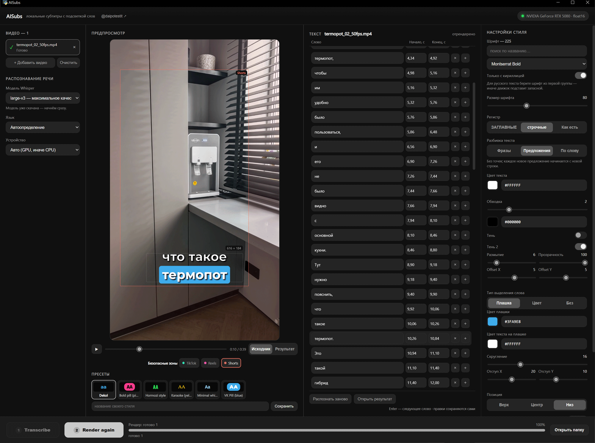

# AISubs — субтитры с пословной подсветкой

Настольная программа для Windows: распознаёт речь в видео, даёт поправить
текст и тайминги каждого слова и вшивает субтитры с подсветкой произносимого
слова — фразами, по предложениям или по одному слову.

Всё работает локально: видео, звук и тексты никуда не отправляются, аккаунт,
API-ключ и подписка не нужны. Интернет нужен только для установки и первой
загрузки модели распознавания.

Эта версия — переработка проекта [AISubs](https://github.com/jimmorisedu-boop/aisubs-local)
([@daipotestit](https://t.me/daipotestit)): один рабочий экран вместо двух
режимов, редактор текста рядом с предпросмотром, новые режимы разбивки текста
и стили теней.

Автор этой версии: [Rennart](https://t.me/rinatmaksutov)

## Как работать

Один экран, один список видео и две кнопки внизу.

| Шаг | Что делать |
|---|---|
| 1 | Перетащите видео в окно или нажмите «+ Добавить видео». |
| 2 | Нажмите **Transcribe** — речь распознаётся во всех файлах, где текста ещё нет. |
| 3 | Кликните файл в списке слева — рядом с предпросмотром откроется его текст. Поправьте слова и тайминги; правки сохраняются сами. |
| 4 | Настройте стиль и нажмите **Render** — субтитры вшиваются во все файлы с готовым текстом. |

Видео можно добавлять в любой момент, в том числе после рендера: новый файл
встаёт в список со статусом «Текст не распознан», и **Transcribe** снова
становится активной. Если после рендера вы поправили текст, файл снова готов к
рендеру. Если нового ничего нет, **Render** превращается в **Render again** и
перерисовывает выбранный файл — удобно после смены стиля.

Кнопка следующего по смыслу шага подсвечена ярче. Под прогрессом внизу всегда
написано, сколько файлов ждут распознавания, сколько готовы к рендеру и
сколько уже готово. «Остановить после файла» доделывает текущий файл и снимает
остальные с очереди.

## Экран

| Колонка | Что в ней |
|---|---|
| **Видео** | список файлов со статусами и прогрессом, настройки распознавания (модель, язык, устройство) |
| **Предпросмотр** | выбранное видео с субтитрами поверх, плеер, переключатель «Исходник / Результат», безопасные зоны, пресеты |
| **Текст** | слова выбранного файла: текст, начало, конец, удалить, вставить |
| **Настройки стиля** | шрифт, регистр, разбивка текста, цвета, обводка, тени, подсветка, позиция |

Предпросмотр занимает всю свободную высоту колонки и показывает ровно те
фразы, которые попадут в видео: слова группируются по тем же правилам, что и
при рендере (ширина блока, число строк, предлоги, точки).

### Статусы файлов

| Статус | Что значит |
|---|---|
| ○ Текст не распознан | файл добавлен, ждёт **Transcribe** |
| ◐ Распознаётся / Рендер | идёт обработка, рядом процент |
| ● Текст готов — проверьте | можно править и рендерить |
| ● Есть правки, не отрендерено | текст меняли после распознавания или рендера |
| ✓ Готово | видео отрендерено, результат в `output/` |
| ✕ Ошибка | причина написана под именем файла; остальные файлы это не останавливает |
| ! Речь не найдена | попробуйте «Распознать заново» с другой моделью или языком |
| ■ Остановлено | обработку остановили; **Transcribe** запустит файл снова |

«×» у файла и «Очистить» убирают видео из списка. Сами файлы на диске
программа никогда не удаляет.

## Редактор текста

- Клик по слову переносит предпросмотр на этот момент и показывает фразу с
  этим словом в текущем стиле.
- **Enter** — следующее слово, **Shift+Enter** — предыдущее.
- Во время воспроизведения текущее слово подсвечивается в списке.
- «×» удаляет слово (вернуть — кнопкой «↶»), «+» вставляет новое слово после
  текущего.
- Слова с низкой уверенностью распознавания обведены **жёлтым** — их стоит
  проверить в первую очередь.
- Ошибки таймингов — конец раньше начала, наезд на предыдущее слово, выход за
  конец видео — подсвечиваются **красным**: с ними файл не отрендерится.
- «Распознать заново» создаёт новую версию текста с текущими настройками
  модели; прошлые версии остаются в истории.

## Разбивка текста

Выбор «Разбивка текста» в настройках стиля. Текст в редакторе при этом не
меняется — режим влияет только на то, что появится на экране.

| Режим | Как выглядит |
|---|---|
| **Фразы** | слова собираются во фразы, сколько помещается по ширине блока и числу строк; знаки препинания как в тексте |
| **Предложения** | без точек; каждое новое предложение начинается с нового субтитра; «?» и «!» остаются |
| **По слову** | одно слово за раз, без знаков препинания и кавычек; слово держится на экране до начала следующего, если пауза короче 0,7 с |

В режиме «По слову» дефис внутри слова («какой-то») и точка внутри числа
(«3.5») сохраняются, а отдельно стоящее тире пропускается.

Предлоги и союзы («в», «на», «и», «что»…) не остаются в конце фразы одни — они
переносятся вместе со следующим словом.

## Стиль

- **Шрифт** — комплектные и установленные в системе, с поиском и фильтром
  реальной поддержки кириллицы.
- **Подсветка слова** — плашка под текущим словом, смена цвета (караоке) или
  без подсветки.
- **Обводка**, **Тень** и **Тень 2** — у каждой тени размытие, прозрачность и
  смещение по осям (Offset X / Offset Y). «Тень 2» рисуется под основной:
  например, мягкое широкое свечение под чёткой тенью. Выключенная тень
  сворачивает свои настройки.
- **Позиция** — верх, центр или низ, отступ от края, число строк и ширина
  блока.
- **Безопасные зоны** TikTok, Reels и Shorts — рамки в предпросмотре (в видео
  не попадают). Кнопка «По зоне» ставит отступ так, чтобы текст с плашкой,
  обводкой и тенями целиком помещался в зону.
- Длинное слово или крупный шрифт уменьшаются ровно настолько, чтобы текст не
  вышел за ширину кадра.

## Пресеты

Пресет — обычный JSON в папке `presets/`. Его можно сохранить из программы
(поле под пресетами → «Сохранить»), поправить вручную или передать коллеге.

```json
{
  "name": "Мой стиль",
  "font": "fonts/Montserrat-var.ttf#ExtraBold",
  "font_size": 84,
  "text_case": "upper",
  "caption_mode": "words",
  "highlight_style": "box",
  "box_color": "#3FA9E8",
  "shadow_enabled": true,
  "shadow_blur": 6,
  "shadow_opacity": 0.45,
  "shadow_offset": [0, 3],
  "shadow2_enabled": true,
  "shadow2_blur": 18,
  "shadow2_opacity": 0.35,
  "shadow2_offset": [0, 10],
  "position": "bottom"
}
```

| Ключ | Значения |
|---|---|
| `caption_mode` | `phrases`, `sentences`, `words` |
| `highlight_style` | `box`, `color`, `none` |
| `text_case` | `upper`, `lower`, `none` |

Любой ключ можно не указывать — возьмётся значение по умолчанию. В
репозитории хранятся только пять встроенных пресетов; сохранённые вами
остаются у вас на компьютере.

## Требования

| | |
|---|---|
| ОС | Windows 10 или 11, 64 бита |
| Видеокарта | NVIDIA с CUDA желательна; без неё распознавание идёт на процессоре, но медленнее |
| Место на диске | около 5 ГБ для окружения и крупной модели |
| Интернет | для установки и разовой загрузки выбранной модели |

Python и ffmpeg отдельно ставить не нужно: установщик кладёт портативное
окружение внутрь папки программы и системный Python не трогает.

Нужен Visual C++ Redistributable 2015–2022 (`MSVCP140.dll`) — на большинстве
систем он уже есть. Если программа ругается на эту библиотеку, поставьте её с
[сайта Microsoft](https://aka.ms/vs/17/release/vc_redist.x64.exe).

## Установка

```bash
git clone https://github.com/Rennart2025/Rennart_aisubs-local.git
cd Rennart_aisubs-local
```

Или скачайте архив: зелёная кнопка **Code → Download ZIP** на странице
репозитория.

1. Запустите **`setup.bat`**.
2. Выберите модель распознавания (`large-v3`, `distil-large-v3` или `small`)
   или пропустите загрузку — тогда модель скачается при первом распознавании.
3. Запускайте программу через **`run.bat`**.

Прерванную установку можно продолжить повторным запуском `setup.bat`. Уже
скачанные модели программа определяет сама.

| Модель | Объём | Назначение |
|---|---:|---|
| `large-v3` | ~3 ГБ | максимальное качество |
| `distil-large-v3` | ~1,5 ГБ | быстрее, почти то же качество |
| `medium` | ~1,5 ГБ | баланс |
| `small` | ~500 МБ | быстрый рабочий вариант |
| `base` | ~150 МБ | черновой вариант |

Модель выбирается в программе, в колонке «Видео». Любую из них можно скачать
заранее вручную:

```bash
python\python.exe download_model.py distil-large-v3
```

### Откуда программа что скачивает

| Что | Откуда | Куда |
|---|---|---|
| Портативный Python 3.11 | [python.org](https://www.python.org/ftp/python/3.11.9/) | `python/` |
| Установщик pip | [bootstrap.pypa.io](https://bootstrap.pypa.io/get-pip.py) | `python/` |
| Библиотеки Python (faster-whisper, moviepy, Pillow, pywebview) | [PyPI](https://pypi.org) | `python/` |
| ffmpeg | [gyan.dev](https://www.gyan.dev/ffmpeg/builds/) | `ffmpeg/` |
| cuBLAS и cuDNN (только если найдена NVIDIA) | PyPI, пакеты NVIDIA | `python/` |
| Модели распознавания | [Hugging Face](https://huggingface.co/Systran), репозитории `Systran/faster-whisper-*` | `models/whisper/` |

Модели — это официальные веса Whisper от OpenAI, переведённые в формат
CTranslate2 командой SYSTRAN (авторы faster-whisper). Прогресс загрузки
модели виден в программе. После загрузки интернет для распознавания больше не
нужен.

### Видеокарта

cuBLAS и cuDNN не входят в драйвер NVIDIA — `setup.bat` ставит их отдельно,
если находит NVIDIA. Режим вычислений подбирается под карту: `float16` на
Volta и новее, `int8_float32` на Pascal (GTX 10xx). Что используется, видно на
значке в правом верхнем углу; если там «CPU режим», подсказка объясняет
причину. Режим «Авто (GPU, иначе CPU)» при недоступной CUDA сам переходит на
процессор.

## Данные, кэш и сброс

| Папка | Что там |
|---|---|
| `output/` | готовые ролики |
| `cache/revisions/` | список видео, все версии текстов и правки |
| `cache/*.words.json` | результаты распознавания |
| `cache/frames/` | кадры для предпросмотра |
| `models/` | модели распознавания |

- Список видео, тексты и правки сохраняются сразу и восстанавливаются после
  перезапуска. Если программу закрыли во время обработки, файл получит статус
  «Остановлено» (или «Ошибка рендера», если шёл рендер) — его можно запустить
  снова, текст не пропадёт.
- Распознавание кэшируется. Ключ учитывает сам файл (путь, размер, время
  изменения), модель и язык: смена стиля не запускает распознавание заново, а
  изменённое видео или другая модель не подхватят чужой результат.
- Готовые ролики не перезаписываются: если `clip_captioned.mp4` уже есть,
  появится `clip_captioned_2.mp4`.
- Полный сброс: закройте программу и удалите папку `cache/`. Модели,
  результаты и пресеты при этом не пострадают.

## Обновление

Если программа установлена через `git clone`:

```bash
git pull
```

Если скачана архивом — скачайте новый архив и распакуйте его в папку
программы с заменой файлов. Папки `python/`, `ffmpeg/`, `models/`, `cache/` и
`output/` в архив не входят, поэтому окружение, модели и ваши данные
сохранятся, и `setup.bat` заново запускать не нужно.

Файл `gui/manual-review.js` из прежних версий больше не используется, его
можно удалить.

## Командная строка

Полный цикл с готовым пресетом, без интерфейса:

```bash
run.bat "видео.mp4" "результат.mp4" --preset presets\vk_blue_pill.json
```

Распознавание и рендер по отдельности:

```bash
python\python.exe transcribe.py видео.mp4 -o слова.json --model large-v3 --language ru
python\python.exe renderer.py видео.mp4 слова.json результат.mp4 --preset presets\hormozi.json
```

## Устройство проекта

| Файл / папка | Назначение |
|---|---|
| `app.py` | окно программы (pywebview) и мост к интерфейсу: список видео, Transcribe/Render, перетаскивание файлов |
| `pipeline.py` | распознавание с кэшем и рендер как отдельные шаги |
| `transcribe.py` | faster-whisper, пословные таймкоды, выбор GPU/CPU, загрузка моделей |
| `renderer.py` | отрисовка субтитров, теней и подсветки, сборка видео |
| `lib/manual_jobs.py` | долговечный список видео: статусы, распознавание и рендер по файлам |
| `lib/transcript_revisions.py` | версии текста, правки, проверка таймингов |
| `lib/segment_parser.py` | разбивка слов на субтитры: фразы, предложения, по слову |
| `lib/typography.py` | предлоги и союзы, которые не оставляются в конце строки |
| `lib/output_planner.py` | имена результатов без перезаписи |
| `gui/index.html` | разметка и стили интерфейса |
| `gui/app.js` | предпросмотр стиля, шрифты, пресеты, настройки |
| `gui/workspace.js` | список видео, редактор текста, плеер, кнопки Transcribe/Render |
| `gui/manual-state.js` | чистые функции: что делают кнопки, проверка таймингов, разбивка для предпросмотра |
| `gui/safe-zones.js` | безопасные зоны соцсетей и отступ «По зоне» |
| `fontlist.py` | поиск шрифтов и проверка кириллицы |
| `mediaserver.py` | локальная раздача видео, кадров и шрифтов интерфейсу |
| `presets/` | встроенные стили |
| `fonts/` | комплектные шрифты |
| `tests/` | тесты |

Папки `python/`, `ffmpeg/`, `models/`, `cache/` и `output/` создаются на
компьютере и в репозиторий не входят.

### Тесты

```bash
python\python.exe -m unittest discover -s tests -p "test_*.py"
node --test "tests/*.test.js"
```

Для JavaScript-тестов нужен [Node.js](https://nodejs.org) 22 или новее;
самой программе он не нужен.

## Авторы и лицензии

- Эта версия: [Rennart](https://t.me/rinatmaksutov) —
  [github.com/Rennart2025/Rennart_aisubs-local](https://github.com/Rennart2025/Rennart_aisubs-local)
- Исходный проект AISubs:
  [github.com/jimmorisedu-boop/aisubs-local](https://github.com/jimmorisedu-boop/aisubs-local),
  [@daipotestit](https://t.me/daipotestit)

Код распространяется по лицензии MIT — см. [`LICENSE`](LICENSE). Лицензия
исходного проекта сохранена.

Шрифты в `fonts/` — SIL Open Font License 1.1: Montserrat, Oswald, Rubik,
Fira Sans, PT Sans, Bebas Neue, Poppins, Anton, Archivo Black и Bangers.

Распознавание построено на [faster-whisper](https://github.com/SYSTRAN/faster-whisper)
(MIT) и [Whisper](https://github.com/openai/whisper) от OpenAI (MIT).
